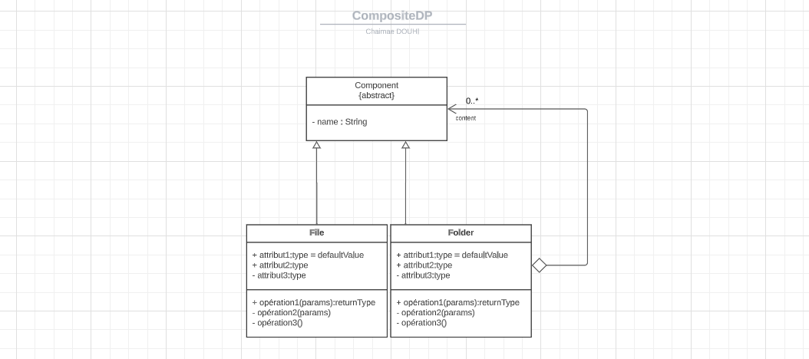
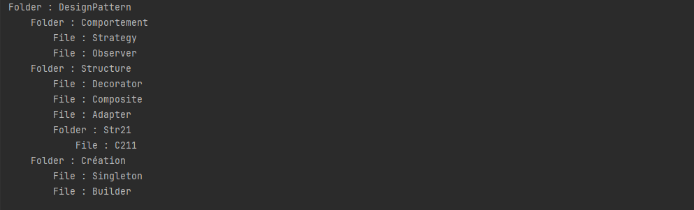

### Composite Pattern
**Composite Pattern** is a structural design pattern that allows you to compose objects into tree structures and then work with these structures as if they were individual objects.

### Examples
* HTML Document Object Model
* Menu Items
* Form Elements
* Web Page Components
* Directory and Files
* etc

### Design Principles
* Classes should be open for extension, but closed for modification.
* Depend upon abstractions. Do not depend upon concrete classes.
* Program to an interface, not an implementation.
* A class should have only one reason to change.
* Strive for loosely coupled designs between objects that interact.

### UML Diagram for file system


#### Description
* Component is the base class for both File and Folder.
* Folder is the composite node.
* File is the leaf node.

### Implementation
* Create a base class Component with common operations for both File and Folder.

```java
public abstract class Component {
    protected String name;
    protected int level = 0;

    public Component(String name) {
        this.name = name;
    }

    public abstract void show();

    public String tab() {
        String tab = "";
        for (int i = 0; i < level; i++) {
            tab += "\t";
        }
        return tab;
    }
}
```
The **level** attribute is used to show the level of the component in the tree structure.


* Create a class File that extends Component.

```java
public class File extends Component {
    public File(String name) {
        super(name);
    }

    @Override
    public void show() {
        System.out.println(tab() + "File : " + name);
    }
}
```

* Create a class Folder that extends Component.

```java
public class Folder extends Component {
    List<Component> childs = new ArrayList<>();

    public Folder(String name) {
        super(name);
    }

    public Component addComponent(Component component) {
        component.level = this.level + 1;
        childs.add(component);
        return component;
    }

    @Override
    public void show() {
        System.out.println(tab() + "Folder : " + name);
        for (Component child : childs) {
            child.show();
        }
    }
}
```

### Output


### Conclusion
Composite Pattern is used when we need to treat a group of objects in similar way as a single object.


